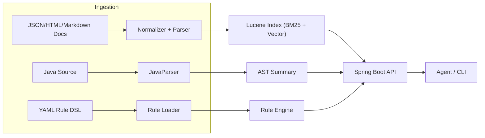
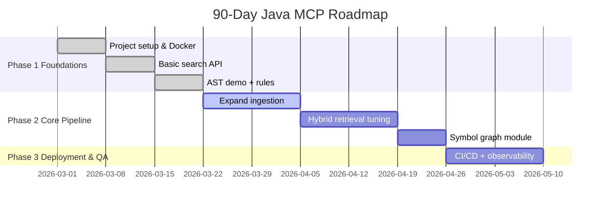

# Java-Only MCP MVP

Java-only Machine-Consumable Knowledge Platform (MCP) MVP for agent workflows:
- Baseline runtime/build: JDK 25, Gradle 9.x, Spring Boot 4
- Spring Boot API (`/api/search`, `/api/ast`, `/api/analyze`, `/api/symbols`, `/api/rules`, `/api/index/*`)
- Context7-inspired tool APIs (`/api/tools/resolve-library-id`, `/api/tools/get-library-docs`)
- Query-first tool API (`/api/tools/query-docs`) with rerank + dedup + score diagnostics
- Multi-source ingestion: classpath JSON + remote HTTP sources (JSON/HTML/Markdown/Text)
- Scheduled background reindexing (`mcp.ingest.schedule.*`)
- MCP discovery APIs (`/api/mcp/manifest`, `/api/mcp/tools`, `/api/mcp/resources`, `/api/mcp/prompts`, `/api/mcp/tool-rules`)
- GraphQL API (`/graphql`) for search/analyze/ast/symbols/index operations
- gRPC API on port `9090` (`mcp.v1.McpService`)
- Prometheus metrics at `/actuator/prometheus`
- Lucene BM25 + vector kNN retrieval (embedded) with weighted hybrid RRF
- Persistent Lucene `SearcherManager` runtime for lower query latency and reduced index-open overhead
- JavaParser AST extraction
- Symbol graph extraction (classes, fields, methods, call edges)
- YAML rule DSL with typed matchers (`AST_METHOD_CALL`, `AST_FIELD_ANNOTATION`, `CONTAINS`, `REGEX`)
- Groovy + Spock test suite
- Gradle build + configuration cache enabled via `gradle.properties`
- Optional API-key auth (`X-API-Key`) with bearer-token fallback (`Authorization: Bearer ...`)
- Docker + Kubernetes manifests
- CI workflows for deploy and nightly reindex

## Architecture



## Endpoints

1. `GET /api/search?q=constructor&limit=5&version=4.0.0&tags=spring,security&source=Spring%20Security%20Reference&mode=HYBRID&diagnostics=true`
2. `POST /api/ast`
3. `POST /api/analyze`
4. `POST /api/symbols`
5. `GET /api/rules`
6. `GET /api/index/stats`
7. `POST /api/index/rebuild`
8. `GET /api/index/sources`
9. `GET /api/tools/resolve-library-id?query=spring+security+csrf&limit=5`
10. `GET /api/tools/query-docs?libraryId=/spring-projects/spring-security&query=csrf&tokens=5000&alpha=0.65`
11. `GET /api/mcp/tools`
12. `GET /api/mcp/manifest`
13. `GET /api/mcp/resources`
14. `GET /api/mcp/prompts`
15. `POST /graphql`
16. `gRPC mcp.v1.McpService` on `localhost:9090`
17. `GET /actuator/prometheus`

### Example: `/api/ast`

```json
{
  "code": "public class A { public void x() {} }"
}
```

### Example: `/api/analyze`

```json
{
  "fileName": "MyService.java",
  "code": "class MyService { void x(){ System.out.println(\"x\"); } }"
}
```

### Example: `/api/symbols`

```json
{
  "code": "class A { void run(){ helper(); } void helper(){} }"
}
```

### Example: `/graphql`

```graphql
query {
  search(q: "constructor injection", limit: 5, mode: HYBRID, diagnostics: true) {
    count
    diagnostics { mode elapsedMillis }
    results { id title sourceUrl }
  }
}
```

```graphql
query {
  mcpManifest {
    serverName
    version
    tools { name }
    toolRules { id toolName priority }
  }
}
```

### Example: Context7-style two-step flow

```bash
# 1) Resolve canonical library ID
curl -s "http://localhost:8080/api/tools/resolve-library-id?query=spring%20security%20csrf&limit=5"

# 2) Retrieve targeted docs for that ID
curl -s "http://localhost:8080/api/tools/query-docs?libraryId=/spring-projects/spring-security&query=csrf&tokens=5000&limit=5&alpha=0.65"
```

### Example: gRPC (`grpcurl`)

```bash
grpcurl -plaintext -d '{"query":"constructor injection","limit":5,"mode":"HYBRID","diagnostics":true}' \
  localhost:9090 mcp.v1.McpService/Search

grpcurl -plaintext -d '{"library_name":"spring security","topic":"csrf","limit":5}' \
  localhost:9090 mcp.v1.McpService/ResolveLibraryId

grpcurl -plaintext -d '{"library_id":"/spring-projects/spring-security","query":"csrf","tokens":5000,"limit":5,"mode":"HYBRID","alpha":0.65}' \
  localhost:9090 mcp.v1.McpService/QueryDocs

grpcurl -plaintext -d '{}' \
  localhost:9090 mcp.v1.McpService/GetMcpManifest
```

### Example: gRPC Java client

```bash
java -cp build/classes/java/main:build/resources/main com.example.javamcp.grpc.McpGrpcClientExample 127.0.0.1 9090 "constructor"
java -cp build/classes/java/main:build/resources/main com.example.javamcp.grpc.McpGrpcClientExample 127.0.0.1 9090 manifest
```

### Helper scripts

```bash
./scripts/grpc/list-services.sh
./scripts/grpc/search.sh "constructor injection" 5 HYBRID
./scripts/grpc/analyze.sh 'class Demo { void run(){ System.out.println("x"); } }'
./scripts/grpc/symbols.sh
./scripts/grpc/index-stats.sh
./scripts/grpc/resolve-library-id.sh "spring security" csrf 5
./scripts/grpc/get-library-docs.sh /spring-projects/spring-security csrf 5000 5 HYBRID
./scripts/grpc/query-docs.sh /spring-projects/spring-security csrf 5000 5 HYBRID 0.65
./scripts/grpc/mcp-manifest.sh
./scripts/rest/search.sh constructor
./scripts/rest/resolve-library-id.sh "spring security" csrf 5
./scripts/rest/get-library-docs.sh /spring-projects/spring-security csrf 5000 5 HYBRID
./scripts/rest/query-docs.sh /spring-projects/spring-security csrf 5000 5 HYBRID 0.65
./scripts/rest/prometheus.sh
./scripts/rest/mcp-manifest.sh
./scripts/rest/mcp-catalog.sh
./scripts/rest/index-sources.sh
./scripts/mcp/setup-codex-mcp.sh
./scripts/mcp/smoke-native-mcp.sh
```

## Metadata Schemas

- Document schema: `src/main/resources/schemas/document.schema.json`
- Rule schema: `src/main/resources/schemas/rule.schema.json`
- Ontology sketch: `src/main/resources/schemas/ontology.yaml`
- gRPC contract: `src/main/proto/mcp.proto`
- gRPC client example: `src/main/java/com/example/javamcp/grpc/McpGrpcClientExample.java`

## Run Locally

```bash
./gradlew test
./gradlew bootRun
```

Then open GraphiQL at `http://localhost:8080/graphiql`.
OpenAPI UI is available at `http://localhost:8080/swagger-ui.html`.

Quick health checks:

```bash
curl -s http://127.0.0.1:8080/actuator/health
curl -s http://127.0.0.1:8080/api/mcp/manifest
```

### Fast local build loop

```bash
# incremental checks
./gradlew test

# package quickly when tests already passed
./gradlew bootJar -x test

# local all-in-one image
docker build -t jmcp:local .
```

### Extensive verification (native MCP)

```bash
# 1) full test suite (Spock + integration)
./gradlew clean test

# 2) build deployable artifact
./gradlew clean bootJar -x test

# 3) build all-in-one local image
docker build -t jmcp:local .

# 4) run locally (separate terminal)
docker run --rm -p 8080:8080 jmcp:local

# 5) stress native MCP transport in loops
JMCP_SMOKE_LOOPS=10 ./scripts/mcp/smoke-native-mcp.sh
```

For remote targets, point the smoke script to your hosted endpoint:

```bash
JMCP_MCP_URL=https://jmcp.example.com/mcp JMCP_SMOKE_LOOPS=10 ./scripts/mcp/smoke-native-mcp.sh
```

Cold starts are retried automatically (`JMCP_SMOKE_INIT_RETRIES`, default `20`).

### Repository cleanup

```bash
# remove compiled outputs
./gradlew clean

# reset local Lucene index data
find data/lucene -mindepth 1 -delete 2>/dev/null || true

# optional: reclaim Docker cache space
docker builder prune -f
```

### Production profile (hardened defaults)

`prod` profile hardening includes:
- GraphiQL disabled
- OpenAPI/Swagger UI disabled
- gRPC reflection disabled
- API key auth enabled when `MCP_API_KEY` is set
- HTTPS redirect enforcement (`mcp.ingress.enforce-https=true`)
- HSTS enabled (`mcp.ingress.hsts-enabled=true`)
- Trusted proxy matching for forwarded headers (`mcp.ingress.trusted-proxies`)
- Optional scheduled reindex (`mcp.ingest.schedule.enabled=true`)
- Optional remote source ingestion (`mcp.ingest.remote-sources`)

Remote ingestion example (in `application.yaml` or profile override):

```yaml
mcp:
  ingest:
    remote-sources:
      - id: spring-security-reference
        url: https://docs.spring.io/spring-security/reference/servlet/exploits/csrf.html
        format: html
        source-name: Spring Security Reference
        source-tag: spring-security
        version: 6.4
        enabled: true
        fail-on-error: false
      - id: jep-444
        url: https://openjdk.org/jeps/444
        format: html
        source-name: OpenJDK JEP
        source-tag: java
        version: 25
        enabled: true
```

Run with Docker:

```bash
docker run --rm \
  -p 8080:8080 -p 9090:9090 \
  -e SPRING_PROFILES_ACTIVE=prod \
  -e MCP_API_KEY='replace-with-strong-secret' \
  -e MCP_TRUSTED_PROXIES='127\\.0\\.0\\.1|::1' \
  -e MCP_REBUILD_ON_STARTUP=false \
  jmcp:local
```

Authentication options when `MCP_API_KEY` is configured:
- `X-API-Key: <MCP_API_KEY>`
- `Authorization: Bearer <MCP_API_KEY>`

Kubernetes:

```bash
kubectl apply -f k8s/secret.example.yaml
kubectl apply -f k8s/tls-secret.example.yaml
kubectl apply -f k8s/deployment.yaml
kubectl apply -f k8s/service.yaml
kubectl apply -f k8s/ingress.yaml
```

## Use as MCP (Antigravity + Codex)

This project now exposes a native MCP streamable HTTP endpoint at:
- `http://127.0.0.1:8080/mcp`

Start JMCP locally first (Docker or Gradle), then wire clients directly.

### Antigravity config (`mcpServers`)

Ready file:
- `scripts/mcp/antigravity-mcp.local.json`

```json
{
  "mcpServers": {
    "jmcp-local": {
      "url": "http://127.0.0.1:8080/mcp"
    }
  }
}
```

### Codex config (CLI-managed)

One-command setup script:

```bash
./scripts/mcp/setup-codex-mcp.sh
```

Equivalent manual command:

```bash
codex mcp add jmcp-local \
  --url http://127.0.0.1:8080/mcp
```

Verify:

```bash
codex mcp list --json
```

If your Codex build requires explicit remote MCP enablement, run with:

```bash
codex --enable rmcp_client
```

### Cloud setup

Use your public JMCP base URL and OpenAPI spec URL:

```bash
codex mcp add jmcp-prod \
  --url https://jmcp.example.com/mcp
```

If your cloud JMCP requires auth, set env vars before starting the MCP client:

```bash
export JMCP_BEARER_TOKEN=<MCP_API_KEY>
codex mcp add jmcp-prod \
  --url https://jmcp.example.com/mcp \
  --bearer-token-env-var JMCP_BEARER_TOKEN
```

### Manual MCP smoke check

```bash
accept='application/json, text/event-stream'

# initialize
curl -s -D /tmp/jmcp-mcp-init.headers -o /tmp/jmcp-mcp-init.body \
  -H "Content-Type: application/json" \
  -H "Accept: ${accept}" \
  -X POST http://127.0.0.1:8080/mcp \
  --data '{"jsonrpc":"2.0","id":"1","method":"initialize","params":{"protocolVersion":"2025-06-18","capabilities":{},"clientInfo":{"name":"curl","version":"1.0"}}}'

sid=$(python3 - <<'PY'
import re
headers = open('/tmp/jmcp-mcp-init.headers').read()
match = re.search(r'(?im)^mcp-session-id:\\s*([^\\r\\n]+)', headers)
print(match.group(1).strip() if match else '')
PY
)

# initialized notification
curl -s -H "Content-Type: application/json" -H "Accept: ${accept}" -H "Mcp-Session-Id: ${sid}" \
  -X POST http://127.0.0.1:8080/mcp \
  --data '{"jsonrpc":"2.0","method":"notifications/initialized","params":{}}' >/dev/null

# list tools
curl -s -H "Content-Type: application/json" -H "Accept: ${accept}" -H "Mcp-Session-Id: ${sid}" \
  -X POST http://127.0.0.1:8080/mcp \
  --data '{"jsonrpc":"2.0","id":"2","method":"tools/list","params":{}}'
```

## Run with Docker

Build a local all-in-one image (JDK 25 runtime + full MCP app):

```bash
docker build -t java-mcp:local .
```

Run it with both service ports exposed:

```bash
docker run --rm \
  -p 8080:8080 \
  -p 9090:9090 \
  --name java-mcp \
  java-mcp:local
```

Validate quickly:

```bash
curl -s http://127.0.0.1:8080/actuator/health
curl -s http://127.0.0.1:8080/api/mcp/manifest
```

Or run with Compose:

```bash
docker compose up --build
```

## Kubernetes

Apply manifests in `k8s/`:

```bash
kubectl apply -f k8s/deployment.yaml
kubectl apply -f k8s/service.yaml
kubectl apply -f k8s/ingress.yaml
```

### Public Internet Access (API-key protected)

On single-node k3s without an external cloud load balancer, ingress is exposed via NodePorts:
- HTTP: `30739`
- HTTPS: `32413`

Example public MCP/API URL format:
- `http://<your-node-public-ip>:30739`

Fetch your runtime API key:

```bash
kubectl -n jmcp-prod get secret mcp-java-secrets -o jsonpath='{.data.api-key}' | base64 --decode
```

Verify over internet:

```bash
curl -H "X-API-Key: <api-key>" http://<your-node-public-ip>:30739/api/mcp/manifest
```

Use in Codex:

```bash
export JMCP_BEARER_TOKEN="<api-key>"
codex mcp add jmcp-prod \
  --url http://<your-node-public-ip>:30739/mcp \
  --bearer-token-env-var JMCP_BEARER_TOKEN
```

Note: this mode is HTTP + API key. For production internet exposure, add a real DNS hostname and TLS cert, then re-enable strict HTTPS in ingress/app settings.

## GitHub Actions Deploy (GHCR -> Kubernetes)

Workflow file:
- `.github/workflows/deploy-k8s.yml`

Pipeline behavior:
- Runs on push to `main` (or manual dispatch).
- Executes `./gradlew clean test` on JDK 25.
- Builds and pushes one image to `ghcr.io/micfabian/jmcp` with tags `sha-<commit>` and `latest`.
- Connects to your cluster using `KUBE_CONFIG`.
- Ensures namespace, GHCR image pull secret, app secret, and TLS secret.
- Applies `k8s/deployment.yaml`, `k8s/service.yaml`, `k8s/ingress.yaml`.
- Deploys with image `ghcr.io/micfabian/jmcp:sha-<commit>` and waits for rollout.
- Includes a separate nightly workflow (`.github/workflows/nightly-reindex.yml`) to call `/api/index/rebuild` on the live service.

Required GitHub repository secrets:
- `KUBE_CONFIG` (full kubeconfig content)
- `GHCR_PULL_TOKEN` (token with read access to GHCR package)
- `MCP_API_KEY` (API key used by JMCP in prod profile)
- `TLS_CERT` (PEM certificate text, optional but recommended)
- `TLS_KEY` (PEM private key text, optional but recommended)

Recommended GitHub repository variables:
- `GHCR_PULL_USERNAME` (defaults to `micfabian` if unset)
- `JMCP_BASE_URL` (required for nightly reindex workflow, e.g. `http://94.16.111.94:30739`)

Set secrets and variables with GitHub CLI:

```bash
export REPO="MicFabian/JMCP"

# required secrets
gh secret set KUBE_CONFIG --repo "$REPO" < ~/.kube/config
gh secret set GHCR_PULL_TOKEN --repo "$REPO" --body "<ghcr-read-token>"
gh secret set MCP_API_KEY --repo "$REPO" --body "<strong-api-key>"

# optional but recommended for TLS ingress
gh secret set TLS_CERT --repo "$REPO" < /absolute/path/fullchain.pem
gh secret set TLS_KEY --repo "$REPO" < /absolute/path/privkey.pem

# recommended variables
gh variable set GHCR_PULL_USERNAME --repo "$REPO" --body "micfabian"
gh variable set JMCP_BASE_URL --repo "$REPO" --body "http://94.16.111.94:30739"
```

Quick trigger:

```bash
git push origin main
```

Manual trigger:

```bash
gh workflow run "Deploy JMCP to Kubernetes" --repo MicFabian/JMCP
```

## 90-Day Roadmap



## Notes on Java 25 / Spring Boot 4

- This repo is pinned to Java 25, Gradle 9.1.0 (wrapper), and Spring Boot 4.
- JVM commands use `--enable-native-access=ALL-UNNAMED` for Lucene native-access compatibility on Java 25.
- Virtual threads are enabled (`spring.threads.virtual.enabled=true`) for request handling and async workloads.
- Ingested docs are normalized and cached in-memory; use `POST /api/index/rebuild` to force reload + reindex.
